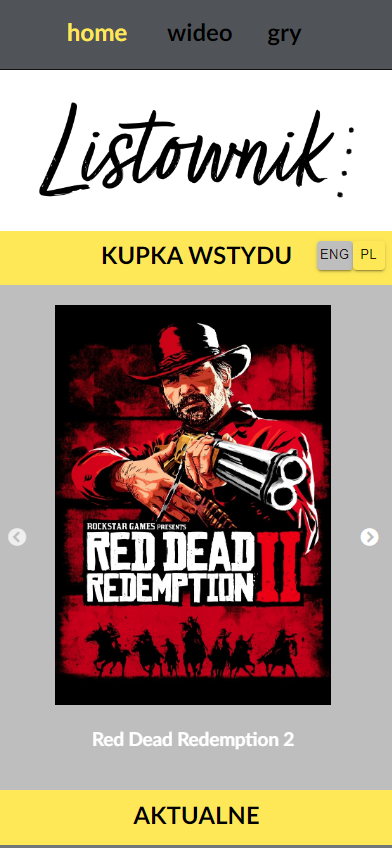

# Listownik - my personal entertainment collection

## Description

Listownik is responsive personal web tracker of your favorite games, movies and series.
It's connected to dedicated project at DatoCMS.com (headless CMS). User need to change API token for his DatoCMS project.

## Screenshots 

### Mobile 

||
|:--:|
|*Home View*|

||
|:--:|
|*Home PL version*|

||
|:--:|
|*Video Category*|

||
|:--:|
|*Games Category*|

||
|:--:|
|*Finished Section*|

||
|:--:|
|*Modal view*|

||
|:--:|
|List view|

### Desktop 
||
|:--:|
|Home page|

||
|:--:|
|Finished Section|

||
|:--:|
|Modal view|

||
|:--:|
|List view|

## Instruction

### Query required from database
It's necessary to create query at your project ( settings -> model)

> - <b>id:</b> unique ID, required
>
> - <b>name:</b> game or video name, reqired
>
> - <b>when:</b> when was watched/played last time or when was date of release. 
> Patterns required: DD-MM-YYYY or DDMMYYY
>
> - <b>releaseYear:</b> game or video release year 
> (required numbers only from 1900 to 2100)
>
> - <b>progress:</b> required, available options:
> >todo: you haven't start yet
> >
> >now: you currently watching or playing it
> >
> >done: already finish watching or playing and maybe you waiting for next part
>
> - <b>platform:</b> required: Amazon, Cinema, HBO, Netflix, Playstation 5, XBOX series X, etc. 
>
> - <b>part:</b> if there's part of game, movie or series season you can enter it here
>
> - <b>wiki:</b> required url for your favorite website describing that video or game: wikipedia, metacritic, imdb, etc
>
> - <b>commingSoon:</b> is it comming soon? 
> > 0 for no
> >
> > 1 for yes
>
> - <b>dateNext:</b> if there's next part you can type expecting release year here (numbers only 2022 onward)
>
> - <b>cover:</b> required cover photo of video or game
>> - {<b>url</b>} - it'll be imported as cover url

## Project status

This project is currently in development. Visitors can check current posters of my entertaiment.

> Still required:
>
> - Integration tests
>
> - Adding posters in app
>
> - Sitemap
>
> - Footer
>
> - External source for posters
>
> - Design upgrade

## Available Scripts

### <b>`Node.js`</b> <u>required for all scripts!</u>

In the project directory, you can run scripts:

### `npm i`

Install packages listed in package.json.
It's required to install packages before starting an app.

### `npm start`

Runs the app in the development mode.\
Open [http://localhost:3000](http://localhost:3000) (with API [http://localhost:3001](http://localhost:3001)) to view it in the browser.

The page will reload if you make edits.\
You will also see any lint errors in the console.

## Reflection

This project helps me understand how to create responsive web app with MUI, unit tests and graphQL. I've learned how to connect app to headless CMS or custom components like slick-carousel and hookrouter. 

## Authors:

#### **Jakub Krzywanski** code

#### **Kinga Kindraczuk** design
